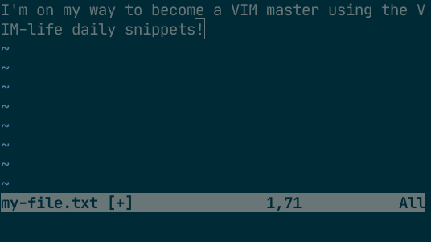

# Day 1: Creating, opening and saving files

Now that you finished *Day 0*, today is very important. Today you will learn how to create, open and save files using VIM. 

After today, you'll be able to use VIM for basic editing. 

## Creating files

To create a new file using VIM, you simply start VIM and pass the filename of the file you want to create as a parameter:

    vim my-file.txt

This will start vim and open the blank, new file *'my-file.txt'* for you to edit. Go ahead, give it a try!

## Editing files

You might have read that VIM is a modal editor. This means that VIM can be in different modes depending on what you are doing. The default is *NORMAL* mode, in this mode you can enter all normal editor commands. 

Let's go ahead and head over to *INSERT* mode. Like the name indicates, in this mode you can start inserting text. Press **i** to enter *INSERT* mode. You will see the bottom of your screen indicate the change in mode:

Go ahead and enter some text now. All key presses will act like you're in a regular old text editor. Type something! 

When you're satisfied, press the **<ESC>** key to return to *NORMAL* mode:

**NOTE**: We will indicate special keys like Escape like this: **<ESC>**. You don't have to press the square brackets ('<' or '>'), just hit the Escape key on your keyboard. Other similar examples are **<ENTER>** for the Enter key or **<CTRL>** for the Control key.

## Opening files
